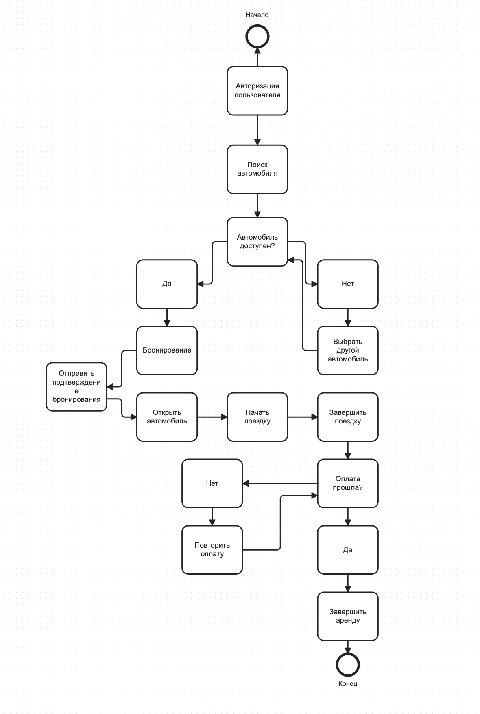
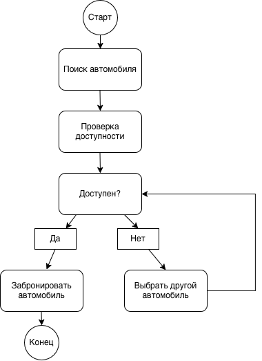
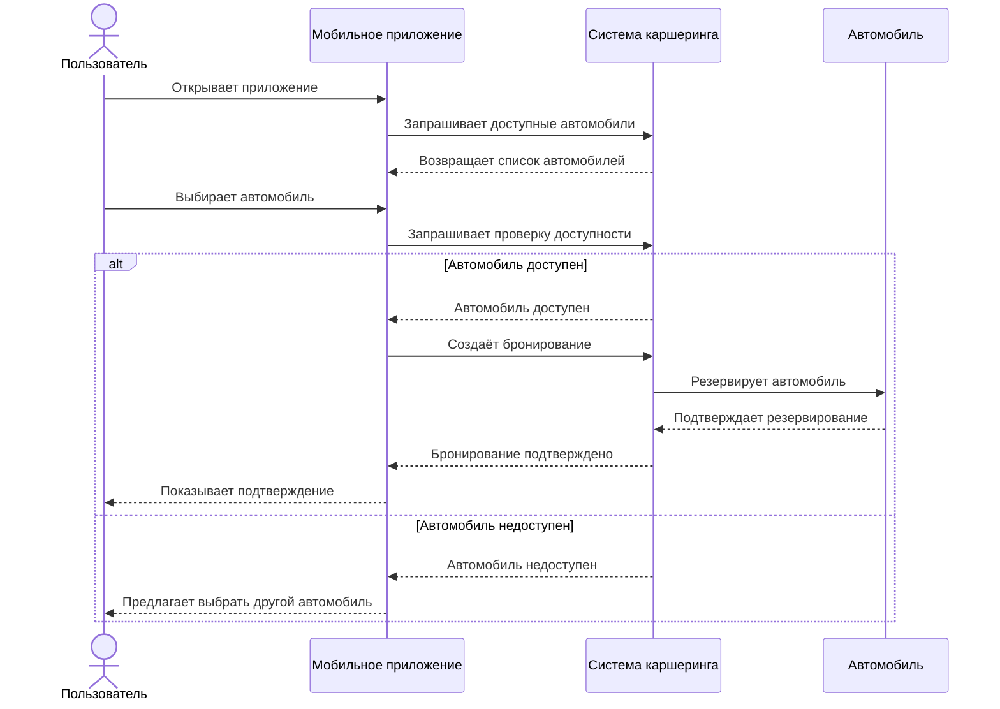
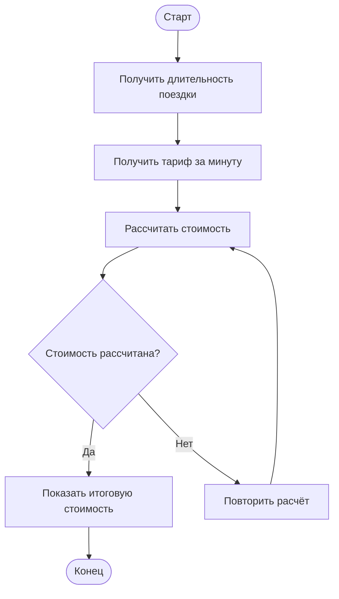

# Отчёт по лабораторной работе

## 1. Описание процесса

В лабораторной работе был рассмотрен процесс аренды автомобиля через сервис каршеринга. Пользователь заходит в приложение, выбирает подходящий автомобиль и проверяет его доступность. После этого автомобиль бронируется, пользователь начинает поездку, а после её окончания система рассчитывает стоимость и выполняет оплату.

## 2. Диаграммы

### BPMN-диаграмма

### UML Activity Diagram

### Sequence Diagram

Диаграмма показывает, как пользователь, приложение, система каршеринга и автомобиль взаимодействуют между собой во время бронирования автомобиля.

### Flowchart

Блок-схема показывает основные действия, которые выполняются при расчёте стоимости поездки.

## 3. Сравнение изменений с помощью Git diff

Во время лабораторной работы были внесены небольшие изменения в диаграммы. Для проверки изменений использовалась команда `git diff`.

Для файлов с текстовым содержимым изменения отображаются построчно. Например, в BPMN-файле можно увидеть добавленный элемент и изменения связей между элементами. Для PNG-файлов Git показывает, что бинарные файлы отличаются.

### Diff BPMN-файла

На скриншоте показаны изменения, которые были внесены в BPMN-диаграмму.

index 18c4013..fff401f 100644
--- a/lab1/diagrams/process.bpmn
+++ b/lab1/diagrams/process.bpmn
@@ -39,10 +39,10 @@
     </bpmn:task>
     <bpmn:sequenceFlow id="Flow_1rnjg8z" sourceRef="Activity_0dnanza" targetRef="Activity_1qc5vqq" />
     <bpmn:task id="Activity_0cqyr5m" name="Открыть автомобиль">
-        <bpmn:incoming>Flow_02pwtbb</bpmn:incoming>
+        <bpmn:incoming>Flow_169nijc</bpmn:incoming>
         <bpmn:outgoing>Flow_00ayc1</bpmn:outgoing>
     </bpmn:task>
-    <bpmn:sequenceFlow id="Flow_02pwtbb" sourceRef="Activity_1qc5vqq" targetRef="Activity_0cqyr5m" />
+    <bpmn:sequenceFlow id="Flow_02pwtbb" sourceRef="Activity_1qc5vqq" targetRef="Activity_02jwao0" />
     <bpmn:task id="Activity_1pdtzmk" name="Начать поездку">
         <bpmn:incoming>Flow_00ayc1</bpmn:incoming>
         <bpmn:outgoing>Flow_01ph59b</bpmn:outgoing>
@@ -89,160 +89,177 @@
         <bpmn:incoming>Flow_0c594hv</bpmn:incoming>
     </bpmn:endEvent>
     <bpmn:sequenceFlow id="Flow_0c594hv" sourceRef="Activity_14krupu" targetRef="Event_11ckcs5" />
+    <bpmn:task id="Activity_02jwao0" name="Отправить подтверждение бронирования">
+        <bpmn:incoming>Flow_02pwtbb</bpmn:incoming>
+        <bpmn:outgoing>Flow_169nijc</bpmn:outgoing>
+    </bpmn:task>
+    <bpmn:sequenceFlow id="Flow_169nijc" sourceRef="Activity_02jwao0" targetRef="Activity_0cqyr5m" />
 </bpmn:process>
 <bpmndi:BPMNDiagram id="BPMNDiagram_1">
     <bpmndi:BPMNPlane id="BPMNPlane_1" bpmnElement="Process_06eavn5">
...skipping...
diff --git a/lab1/diagrams/process.bpmn b/lab1/diagrams/process.bpmn
index 18c4013..fff401f 100644
--- a/lab1/diagrams/process.bpmn
+++ b/lab1/diagrams/process.bpmn
@@ -39,10 +39,10 @@
     </bpmn:task>
     <bpmn:sequenceFlow id="Flow_1rnjg8z" sourceRef="Activity_0dnanza" targetRef="Activity_1qc5vqq" />
     <bpmn:task id="Activity_0cqyr5m" name="Открыть автомобиль">
-        <bpmn:incoming>Flow_02pwtbb</bpmn:incoming>
+        <bpmn:incoming>Flow_169nijc</bpmn:incoming>
         <bpmn:outgoing>Flow_00ayc1</bpmn:outgoing>
     </bpmn:task>
-    <bpmn:sequenceFlow id="Flow_02pwtbb" sourceRef="Activity_1qc5vqq" targetRef="Activity_0cqyr5m" />
+    <bpmn:sequenceFlow id="Flow_02pwtbb" sourceRef="Activity_1qc5vqq" targetRef="Activity_02jwao0" />
     <bpmn:task id="Activity_1pdtzmk" name="Начать поездку">
         <bpmn:incoming>Flow_00ayc1</bpmn:incoming>
         <bpmn:outgoing>Flow_01ph59b</bpmn:outgoing>
@@ -89,160 +89,177 @@
         <bpmn:incoming>Flow_0c594hv</bpmn:incoming>
     </bpmn:endEvent>
     <bpmn:sequenceFlow id="Flow_0c594hv" sourceRef="Activity_14krupu" targetRef="Event_11ckcs5" />
+    <bpmn:task id="Activity_02jwao0" name="Отправить подтверждение бронирования">
+        <bpmn:incoming>Flow_02pwtbb</bpmn:incoming>
+        <bpmn:outgoing>Flow_169nijc</bpmn:outgoing>
+    </bpmn:task>
+    <bpmn:sequenceFlow id="Flow_169nijc" sourceRef="Activity_02jwao0" targetRef="Activity_0cqyr5m" />
 </bpmn:process>
 <bpmndi:BPMNDiagram id="BPMNDiagram_1">
     <bpmndi:BPMNPlane id="BPMNPlane_1" bpmnElement="Process_06eavn5">
     <bpmndi:BPMNShape id="Activity_14krupu_di" bpmnElement="Activity_14krupu">
:

## 4. Выводы

В ходе лабораторной работы я научился описывать один и тот же процесс с помощью разных видов диаграмм. Я разобрался с BPMN, UML Activity Diagram, диаграммой последовательности и блок-схемой. Также я научился сохранять диаграммы в нужных форматах и проверять изменения в файлах с помощью Git и команды `diff`. Это позволило увидеть разницу между изменениями в текстовых и бинарных файлах.
